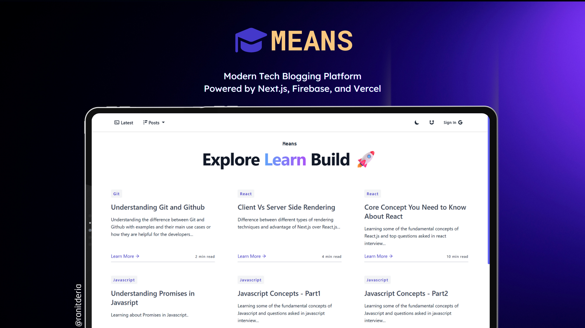

<div align="center">
  
  
  
  

[](https://twitter.com/intent/follow?screen_name=DeriaRanit)
[](https://www.linkedin.com/in/ranit-deria-916864257/)

  <br />
  <br />
  
  


  <h2 align="center">MEANS - Modern Tech Blog Platform</h2>

MEANS is a cutting-edge tech blogging platform built with Next.js and Firebase that enables developers and tech enthusiasts to share their knowledge and insights. The platform features a sleek modern design with dark/light theme support, Google authentication, real-time data synchronization, and an intuitive content management system for creating and publishing technical articles across various programming topics.<br />

<a href="https://means-blog.vercel.app/"><strong>➥ Live Demo</strong></a>

<br/>

</div>

## Table of Contents

- [Prerequisites](#prerequisites)
- [Technologies Utilized](#technologies-utilized)
- [Features](#features)
- [Run Locally](#run-locally)
- [Installation](#installation)
- [Usage](#usage)
- [Deployment](#deployment)
- [Environment Variables](#environment-variables)
- [Project Structure](#project-structure)
- [Contributing](#contributing)
- [License](#license)
- [Contact](#contact)

### Prerequisites:<a name="prerequisites"></a>

Before running the application on your local machine, ensure you have the following installed:

- **[Node.js](https://nodejs.org/)** (v16 or higher)
- **[npm](https://www.npmjs.com/)** or **[yarn](https://yarnpkg.com/)** (package manager)
- **[Git](https://git-scm.com/)** (for version control)
- **[Firebase Account](https://firebase.google.com/)** (for authentication and database)
- **[Vercel Account](https://vercel.com/)** (optional, for deployment)

You will also need to set up the required environment variables and Firebase configuration as mentioned in the documentation.

### Technologies and Services Utilized: <a name="technologies-utilized"></a>

- **Frontend Framework:**  Next.js
- **UI Library:**  React.js
- **Programming Language:**  JavaScript
- **CSS Framework:**  Tailwind CSS
- **Backend Services:**  Firebase
- **Authentication:**  Google Authentication
- **Database:**  Cloud Firestore
- **Deployment Platform:**  Vercel
- **Package Manager:**  npm
- **State Management:**  Redux
- **Theme Management:**  next-themes
- **Icons:**  React Icons

### Features: <a name="features"></a>

- **🔐 Google Authentication:** Secure user authentication using Firebase Auth with Google Sign-In
- **📝 Content Management:** Create, edit, and manage blog posts with markdown support
- **🎨 Theme Support:** Dynamic dark/light theme switching with next-themes
- **📱 Responsive Design:** Mobile-first responsive design that works on all devices
- **🔍 Topic Filtering:** Browse blog posts by categories and topics
- **⚡ Fast Performance:** Optimized with Next.js for lightning-fast page loads
- **🔥 Real-time Data:** Real-time data synchronization with Cloud Firestore
- **📊 Reading Time:** Automatic reading time calculation for each blog post
- **🏷️ Tag System:** Organize content with tags and categories
- **🎯 SEO Optimized:** Built-in SEO optimization with meta tags and Open Graph support
- **💨 Static Generation:** Pre-rendered pages for better performance and SEO
- **🎪 Interactive UI:** Smooth animations and hover effects for better UX

### Run Locally: <a name="run-locally"></a>

To run **MEANS** locally, follow the steps below:

**Linux, macOS, and Windows:**

1. **Clone the repository:**

   ```bash
   git clone https://github.com/RanitDERIA/means-blog.git
   ```

2. **Navigate to project directory:**

   ```bash
   cd means-blog
   ```

3. **Install dependencies:**

   ```bash
   npm install
   # or
   yarn install
   ```

4. **Set up Firebase:**

   - Create a new Firebase project at [Firebase Console](https://console.firebase.google.com/)
   - Enable Authentication and Firestore Database
   - Enable Google Sign-In provider in Authentication
   - Add your domain to authorized domains in Firebase Auth settings

5. **Configure environment variables:**
   Create a `.env.local` file in the root directory and add your Firebase configuration:

   ```env
   NEXT_PUBLIC_FIREBASE_API_KEY=your_api_key
   NEXT_PUBLIC_FIREBASE_AUTH_DOMAIN=your_project_id.firebaseapp.com
   NEXT_PUBLIC_FIREBASE_PROJECT_ID=your_project_id
   NEXT_PUBLIC_FIREBASE_STORAGE_BUCKET=your_project_id.appspot.com
   NEXT_PUBLIC_FIREBASE_SENDER_ID=your_sender_id
   NEXT_PUBLIC_FIREBASE_APP_ID=your_app_id
   NEXT_PUBLIC_FIREBASE_MEASUREMENT_ID=your_measurement_id
   FIREBASE_CLIENT_EMAIL=your_service_account_email
   FIREBASE_PRIVATE_KEY=your_private_key
   FIREBASE_PROJECT_ID=your_project_id
   FIREBASE_DATABASE_URL=your_database_url
   ```

6. **Start the development server:**

   ```bash
   npm run dev
   # or
   yarn dev
   ```

7. **Open your browser:**
   Navigate to [http://localhost:3000](http://localhost:3000) to see the application running.

### Installation: <a name="installation"></a>

Clone the repository from GitHub:

[](https://github.com/RanitDERIA/means-blog)

### Usage: <a name="usage"></a>

- **🏠 Home Page:** Browse the latest tech blog posts and articles
- **📚 Topic Navigation:** Filter posts by programming languages and tech topics
- **🔐 Authentication:** Sign in with Google to access personalized features
- **📖 Reading Experience:** Enjoy clean, readable blog posts with estimated reading time
- **🌙 Theme Toggle:** Switch between light and dark modes for comfortable reading
- **📱 Mobile Friendly:** Access the platform seamlessly on any device
- **🔍 Content Discovery:** Explore diverse tech topics and programming tutorials

### Deployment: <a name="deployment"></a>

The application is optimized for deployment on **Vercel**, but can also be deployed to other platforms that support Next.js:

**Deploy to Vercel:**

1. Push your code to GitHub
2. Connect your repository to Vercel
3. Add environment variables in Vercel dashboard
4. Deploy automatically

**Other deployment options:**

- Netlify
- Firebase Hosting
- AWS Amplify
- Railway

### Environment Variables: <a name="environment-variables"></a>

You will need the following environment variables:

**Firebase Configuration (.env.local):**

```env
NEXT_PUBLIC_FIREBASE_API_KEY=your_firebase_api_key
NEXT_PUBLIC_FIREBASE_AUTH_DOMAIN=your_project.firebaseapp.com
NEXT_PUBLIC_FIREBASE_PROJECT_ID=your_project_id
NEXT_PUBLIC_FIREBASE_STORAGE_BUCKET=your_project.appspot.com
NEXT_PUBLIC_FIREBASE_SENDER_ID=your_sender_id
NEXT_PUBLIC_FIREBASE_APP_ID=your_app_id
NEXT_PUBLIC_FIREBASE_MEASUREMENT_ID=your_measurement_id
```

**Firebase Admin (for server-side operations):**

```env
FIREBASE_CLIENT_EMAIL=your_service_account_email
FIREBASE_PRIVATE_KEY=your_private_key_with_newlines
FIREBASE_PROJECT_ID=your_project_id
FIREBASE_DATABASE_URL=your_database_url
```

### Project Structure: <a name="project-structure"></a>

```
means-blog/
├── Components/           # React components
│   ├── Alert.js         # Alert notifications
│   ├── BlogHeader.js    # Blog post preview cards
│   ├── Footer.js        # Footer component
│   ├── Header.js        # Page header
│   └── Navbar.js        # Navigation bar
├── Firebase/            # Firebase configuration
│   ├── Firebase.js      # Client-side config
│   └── Firebase-admin.js # Admin SDK config
├── Lib/                 # Utility functions
│   └── Data.js          # Data processing utilities
├── pages/               # Next.js pages
│   ├── _app.js          # App wrapper
│   ├── index.js         # Home page
│   ├── about.js         # About page
│   └── topic/           # Dynamic topic pages
├── posts/               # Markdown blog posts
├── public/              # Static assets
│   └── Extra/           # Images and icons
├── styles/              # CSS styles
└── Store/               # Redux store configuration
```

### Contributing: <a name="contributing"></a>

Contributions are always welcome! 🎉

If you'd like to contribute to this project, please follow these guidelines:

1. **Fork the repository** 🍴
2. **Create a feature branch:** `git checkout -b feature/amazing-feature`
3. **Make your changes and commit:** `git commit -m 'Add some amazing feature'`
4. **Push to the branch:** `git push origin feature/amazing-feature`
5. **Open a Pull Request** 🚀

**Types of contributions we welcome:**

- 🐛 Bug fixes
- ✨ New features
- 📚 Documentation improvements
- 🎨 UI/UX enhancements
- ⚡ Performance optimizations
- 🧪 Tests

### License: <a name="license"></a>

This project is licensed under the **MIT License** - see the [LICENSE](LICENSE) file for details.

### Contact: <a name="contact"></a>

If you want to get in touch or have any questions regarding this project, feel free to reach out:

💼 **LinkedIn:** [Ranit Deria](https://www.linkedin.com/in/ranit-deria-916864257/)
🐦 **Twitter:** [@DeriaRanit](https://twitter.com/DeriaRanit)
💻 **GitHub:** [@RanitDERIA](https://github.com/RanitDERIA)

For any inquiries, suggestions, or bug reports, you can also:

- 🐛 Open an issue on GitHub
- 💬 Start a discussion in the repository
- 📩 Send a direct message via social media

---

<div align="center">
  
**⭐ Star this repository if you find it helpful!**

Made with ❤️ by [Ranit Deria](https://github.com/RanitDERIA)

</div>
